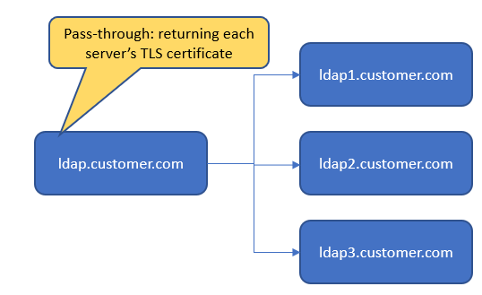
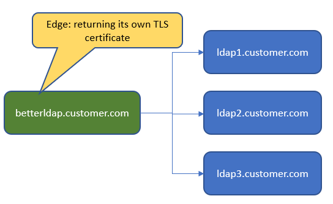

# Configuring HAProxy as LDAPS load balancer
A unified script for the entire set up is available at [ldapproxy.sh](ldapproxy.sh).

As of IBM Cloud Pak Common Services 3.20, the Identity and Access Management (IAM) component can connect to multiple LDAP logical servers, where each of these connection represents its unique user population.
There are a few customers who expose multiple LDAP server replicas and expect client applications to allow configuring a list of LDAP connection settings in order to connect to any one of these replicas and gain access to user, group and membership information of the one and only user population.
Ususally, these LDAP server replicas would be hidden behind a load balancer that allows clients to connect to a single hostname and hide thus hide the complexity of managing failovers and of course avoiding the need to maintain the list of all possible LDAP servers in all clients.
For some reason there are a few customers who implemented a virtual IP address to load balance traffic to their LDAP servers, however, the TLS certificates presented by each LDAP replica during the TLS handshake does not include the virtual IP address / the load balancer's hostname. Therefore, the connection must fail when hostname validation is enabled.
.

This sample outlines the set up of HAProxy as a load balancer that performs TLS termination of client connections using its own (proper) certificate, while connecting to one or more backend LDAP servers via LDAPS protocol.
.


## Prepare
The sample set up is tested on a Centos machine in the fyre environment proxying requests to bluepages. `ldapsearch` had to be installed for testing.
```bash
dnf install openldap-clients
```

## Create HAProxy TLS certificate chain
In order to present a certificate to clients that connect to HAPrxoy, this sample creates a self-signed CA certificate which in turn is used to sign the HAProxy certificate. The HAProxy certificate includes the test machines hostname. Note that defaults are used in many places for simplicity. This is likely not production ready!

1. Create CA key and certificate
```bash
openssl genrsa -passout pass:passw0rd -aes256 -out myCA.key 4096
openssl req -x509 -new -nodes -key myCA.key -sha256 -days 1825 -out myCA.pem -subj '/CN=root/O=ldaptest' -passin pass:passw0rd
```
2. Create HAProxy key and certificate signing request
```bash
openssl genrsa -passout pass:passw0rd -out ldapproxy.key 4096
openssl req -new -key ldapproxy.key -out ldapproxy.csr -subj '/CN=ldapproxy/O=ldaptest' -passin pass:passw0rd
```
3. Sign HAProxy certificate using the self-signed CA
OpenSSL can consume configuration files to specify certificate signing. Create a file `ldapproxy.ext` with the following contents: 
```
authorityKeyIdentifier=keyid,issuer
basicConstraints=CA:FALSE
keyUsage = digitalSignature, nonRepudiation, keyEncipherment, dataEncipherment
subjectAltName = @alt_names

[alt_names]
DNS.1 = comfy1.fyre.ibm.com
DNS.2 = ldapproxy.ibm.com
```
Refer to this file when signing the certificate signing request:
```bash
openssl x509 -req -in ldapproxy.csr -CA myCA.pem -CAkey myCA.key -CAcreateserial -out ldapproxy.pem -days 30 -sha256 -extfile ldapproxy.ext -passin pass:passw0rd
```
4. Combine all key material in a bundle
HAProxy requires private key and certificate in a single file. In this sample certificate refers to the certificate chain of HAProxy and its CA.
```bash
cat ssl/ldapproxy.pem ssl/myCA.pem ssl/ldapproxy.key > private/ldapproxy.bundle
```

## Obtain bluepages certificate chain
As the sample machine has Java installed, the most convenient way to obtain the cert chain is 
```bash
keytool -printcert -sslserver bluepages.ibm.com:636 -rfc > certs/bluepages.pem
```

## Create HAProxy configuration file
The sample defines one frontend that clients can connect to. To allow non-root usage, a port >1024 is easiest. The frontend refers to the server's own key material for TLS.
The sample also defines a backend with a single `server` entry for connecting to bluepages. The same line can be repeated for all other LDAP replicas, just the reference to the target server's certificate must match the target host.

Sample `haproxy.conf` file:

```
global
  user       haproxy
  group      haproxy
  
defaults
  timeout http-request    10s
  timeout queue           1m
  timeout connect         10s
  timeout client          1m
  timeout server          1m
  timeout http-keep-alive 10s
  timeout check           10s
  maxconn                 3000
  
frontend ldaps_service_front
  mode                  tcp
  bind                  :1636 ssl crt /etc/ssl/private/ldapproxy.bundle
  description           LDAPS Service
  option                tcpka
  default_backend       ldaps_service_back

backend ldaps_service_back
  server                ldap1 bluepages.ibm.com:636 ssl ca-file /etc/ssl/certs/bluepages.pem 
  mode                  tcp
  balance               leastconn
  option                ldap-check
  timeout server        10s
  timeout connect       1s
```

## Running HAProxy
HAProxy is conveniently available as docker image. The files (config and certificates) can be mounted into the image:
```bash
podman run -d --name hap -v $(pwd)/private:/etc/ssl/private -v $(pwd)/config:/usr/local/etc/haproxy:ro -v $(pwd)/certs:/etc/ssl/certs -p 1636:1636 haproxy
```

## Testing
There are two interesting aspects to test: 
1. Which certificate is returned when connecting to the server?
```bash
openssl s_client -showcerts -connect comfy1.fyre.ibm.com:1636 </dev/null

....
Server certificate
subject=/CN=ldapproxy/O=ldaptest
issuer=/CN=root/O=ldaptest
...
```
2. Can we actually browse LDAP? For this search to work, we need to provide the HAProxy's signer certificate to ldapsearch by exporting a env var `LDAPTLS_CACERT` with reference to the signer cert. Then regular ldapsearch can show bluepages entries:
```bash
export LDAPTLS_CACERT=$(pwd)/ssl/myCA.pem
ldapsearch -x  -H ldaps://comfy1.fyre.ibm.com:1636 -b ou=bluepages,o=ibm.com 'mail=jens.engelke@de.ibm.com' cn
# extended LDIF
#
# LDAPv3
# base <ou=bluepages,o=ibm.com> with scope subtree
# filter: mail=jens.engelke@de.ibm.com
# requesting: cn 
#

# 117713724, de, bluepages, ibm.com
dn: uid=117713724,c=de,ou=bluepages,o=ibm.com
cn: Jens Engelke

# search result
search: 2
result: 0 Success

# numResponses: 2
# numEntries: 1
```
